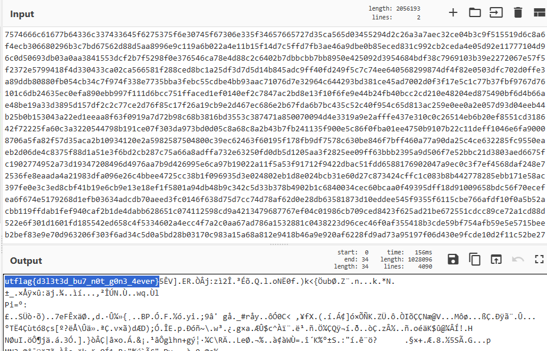
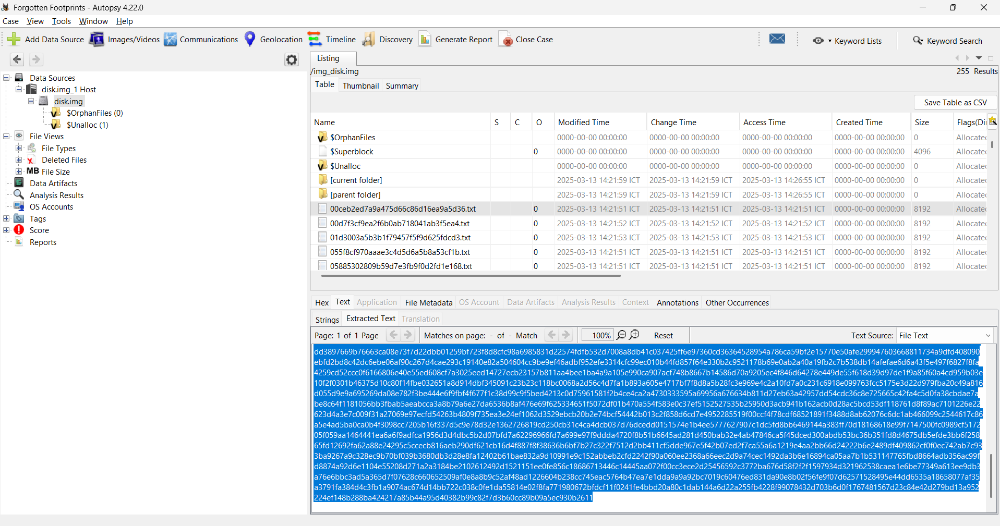
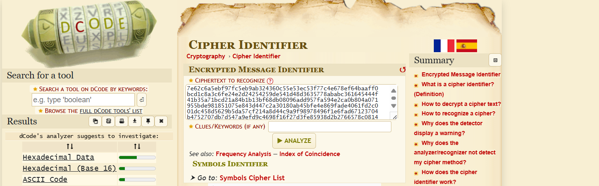
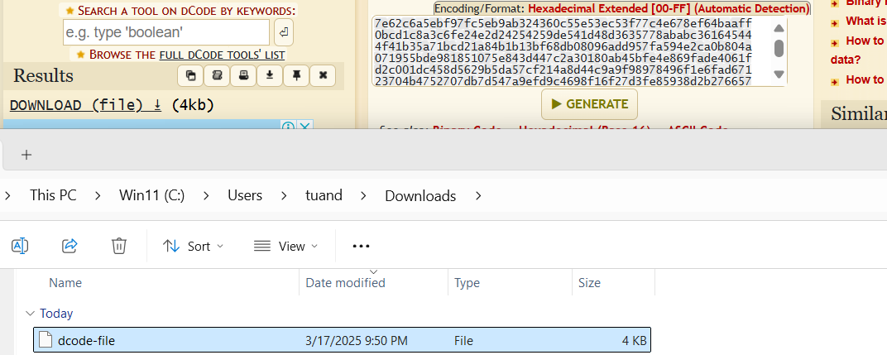
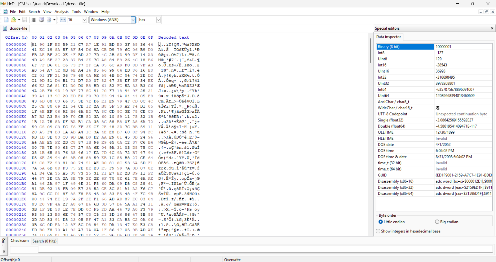
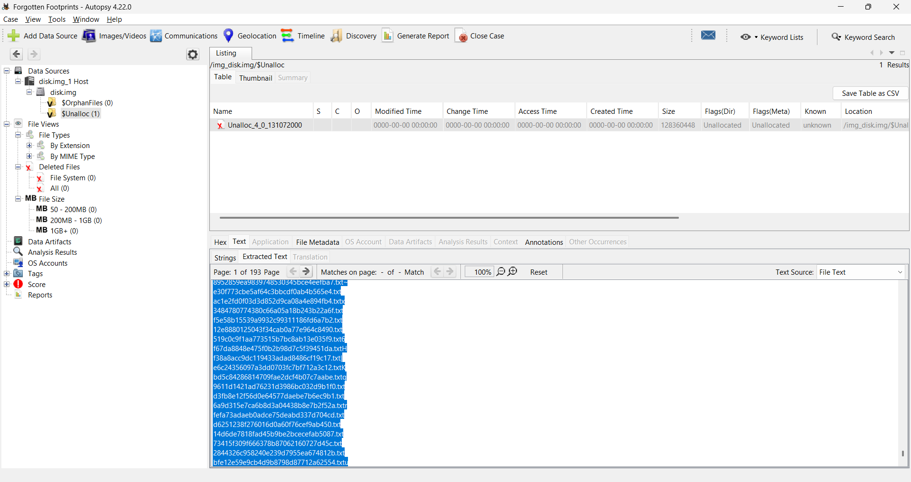
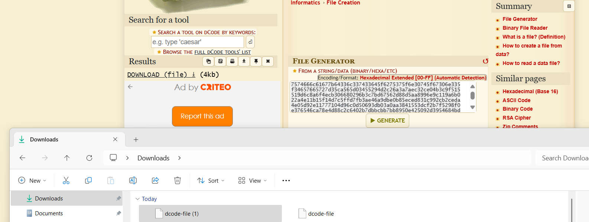
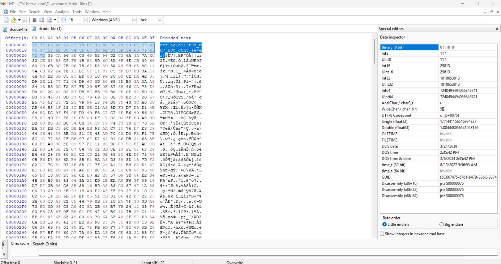

# Forgotten Footprints
## Forensic
## Description

>I didn't want anyone to find the flag, so I hid it away. Unfortunately, I seem to have misplaced it.

# Given:
- disk.img

# Solution

What do we have here:

```bash
disk.img: BTRFS Filesystem sectorsize 4096, nodesize 16384, leafsize 16384, UUID=19796fde-a3e0-4003-a5c6-607e2f34b80f, 2375680/131072000 bytes used, 1 devices
```
I CAN'T BELIEVE ITS NOT BUTTER!

Lets mount that up shall we?

```bash
sudo mount -o loop disk.img /mnt/unlock
```

File list:

<details>

```bash
ls -lah
total 2.0M
drwxr-xr-x  1 tma  tma   18K Mar 13 03:21 .
drwxr-xr-x 24 root root 4.0K Mar 10 16:27 ..
-rw-r--r--  1 tma  tma  8.0K Mar 13 03:21 00ceb2ed7a9a475d66c86d16ea9a5d36.txt
-rw-r--r--  1 tma  tma  8.0K Mar 13 03:21 00d7f3cf9ea2f6b0ab718041ab3f5ea4.txt
-rw-r--r--  1 tma  tma  8.0K Mar 13 03:21 01d3003a5b3b1f79457f5f9d625fdcd3.txt
-rw-r--r--  1 tma  tma  8.0K Mar 13 03:21 055f8cf970aaae3c4d5d6a5b8a53cf1b.txt
-rw-r--r--  1 tma  tma  8.0K Mar 13 03:21 05885302809b59d7e3fb9f0d2fd1e168.txt
-rw-r--r--  1 tma  tma  8.0K Mar 13 03:21 060dc77d7342b51aad80410a0049abaa.txt
-rw-r--r--  1 tma  tma  8.0K Mar 13 03:21 06a381ea77e934e518cdc15da4cade0e.txt
-rw-r--r--  1 tma  tma  8.0K Mar 13 03:21 076844fd1cf63bfa18dd5780cf3f0eba.txt
-rw-r--r--  1 tma  tma  8.0K Mar 13 03:21 07ffeabdccab4491dd2612384808f8eb.txt
-rw-r--r--  1 tma  tma  8.0K Mar 13 03:21 0871fbecc6befd2eea2c3fec3876708d.txt
-rw-r--r--  1 tma  tma  8.0K Mar 13 03:21 087fdc216a55c9937b232c248180329c.txt
-rw-r--r--  1 tma  tma  8.0K Mar 13 03:21 094ab5958b742f7b68b56e4ab0018ff5.txt
-rw-r--r--  1 tma  tma  8.0K Mar 13 03:21 0989207ed3ae819bc84535c40089ad23.txt
-rw-r--r--  1 tma  tma  8.0K Mar 13 03:21 0c49baffcc12b24f4dc303b470f34b34.txt
-rw-r--r--  1 tma  tma  8.0K Mar 13 03:21 0eadbad0654e7e65d1a1f18d7c7c625c.txt
-rw-r--r--  1 tma  tma  8.0K Mar 13 03:21 0edb8fc7eeba079a952fd2214c409fc9.txt
-rw-r--r--  1 tma  tma  8.0K Mar 13 03:21 1167193a258d6820670065d6f537983d.txt
-rw-r--r--  1 tma  tma  8.0K Mar 13 03:21 12af7c4937af19e477e992ca04879b9b.txt
-rw-r--r--  1 tma  tma  8.0K Mar 13 03:21 12c243ae147ad4eb4201481b101366a8.txt
-rw-r--r--  1 tma  tma  8.0K Mar 13 03:21 12e8880125043f34cab0a77e964c8490.txt
-rw-r--r--  1 tma  tma  8.0K Mar 13 03:21 1362130475cfbd994b9523d10f346722.txt
-rw-r--r--  1 tma  tma  8.0K Mar 13 03:21 14d6de7818fad45b9be2bcecefab5087.txt
-rw-r--r--  1 tma  tma  8.0K Mar 13 03:21 15007bb1b2d9915be7223c65bd2bb9c9.txt
-rw-r--r--  1 tma  tma  8.0K Mar 13 03:21 15281b46748f740a7ba7f80e0058c4e4.txt
-rw-r--r--  1 tma  tma  8.0K Mar 13 03:21 15e4dec1654bc2c1d2712cd407d7f307.txt
-rw-r--r--  1 tma  tma  8.0K Mar 13 03:21 187fd1b1f62bf53283d219370a7706da.txt
-rw-r--r--  1 tma  tma  8.0K Mar 13 03:21 18953ff58ea03efbd10c717ba71dc400.txt
-rw-r--r--  1 tma  tma  8.0K Mar 13 03:21 19a443a3c90af244052003b9ec9bbb2c.txt
-rw-r--r--  1 tma  tma  8.0K Mar 13 03:21 1afec71268efb74472885284e9572131.txt
-rw-r--r--  1 tma  tma  8.0K Mar 13 03:21 1c594183c7f2c599d32117875619821e.txt
-rw-r--r--  1 tma  tma  8.0K Mar 13 03:21 1cd1bffc3c3061399bdb3fff2acb77bf.txt
-rw-r--r--  1 tma  tma  8.0K Mar 13 03:21 1e2e9812e6306811f5adff5616df72f5.txt
-rw-r--r--  1 tma  tma  8.0K Mar 13 03:21 1ea4d194e4f66460f174551bc17f5958.txt
-rw-r--r--  1 tma  tma  8.0K Mar 13 03:21 209d3acf9a9585513a21be602f8133c0.txt
-rw-r--r--  1 tma  tma  8.0K Mar 13 03:21 21e6129b5a9ec245fa74ce4dc5e45da5.txt
-rw-r--r--  1 tma  tma  8.0K Mar 13 03:21 22f305b98c0753c5d83c4edd87ae2164.txt
-rw-r--r--  1 tma  tma  8.0K Mar 13 03:21 258e34769844a3af54617e43c99d35b2.txt
-rw-r--r--  1 tma  tma  8.0K Mar 13 03:21 262e3cf7e900c1b5296092c272da7a00.txt
-rw-r--r--  1 tma  tma  8.0K Mar 13 03:21 26f568e51110f3a6fe4e471d13aa3617.txt
-rw-r--r--  1 tma  tma  8.0K Mar 13 03:21 27257325c555e7783fad6798e7d5221e.txt
-rw-r--r--  1 tma  tma  8.0K Mar 13 03:21 2844326c958240e239d7955ea674812b.txt
-rw-r--r--  1 tma  tma  8.0K Mar 13 03:21 28ce13c5cb7fd43c3c2ace9d32ccbec9.txt
-rw-r--r--  1 tma  tma  8.0K Mar 13 03:21 2a00f04b135303d9354622254a4732fb.txt
-rw-r--r--  1 tma  tma  8.0K Mar 13 03:21 2aefafa708feb8d7c05ffb6c552b3629.txt
-rw-r--r--  1 tma  tma  8.0K Mar 13 03:21 2b8a95600262f13e7afb24e4b0b50b6e.txt
-rw-r--r--  1 tma  tma  8.0K Mar 13 03:21 2dab597228d4a54c0b7ddb174b2f90ef.txt
-rw-r--r--  1 tma  tma  8.0K Mar 13 03:21 2dc64511430f6b82af2fb0670ed27a97.txt
-rw-r--r--  1 tma  tma  8.0K Mar 13 03:21 2ddd45b2d8ec0793c42d1b847d186078.txt
-rw-r--r--  1 tma  tma  8.0K Mar 13 03:21 2de4c3ec8acaf8bc9ab4739de9dfa7bb.txt
-rw-r--r--  1 tma  tma  8.0K Mar 13 03:21 2e1facc7f78671e2c935453654558a3f.txt
-rw-r--r--  1 tma  tma  8.0K Mar 13 03:21 2e467e901d123724941329a727b0bf50.txt
-rw-r--r--  1 tma  tma  8.0K Mar 13 03:21 2f168ea7ec03859f5454c4257472df1b.txt
-rw-r--r--  1 tma  tma  8.0K Mar 13 03:21 2f26b97ce51a92621053ffede18b3ca9.txt
-rw-r--r--  1 tma  tma  8.0K Mar 13 03:21 310946b435c5ba157d6e1b4ac415d66a.txt
-rw-r--r--  1 tma  tma  8.0K Mar 13 03:21 3152c1e78efd2cb821d710ed015b3d5b.txt
-rw-r--r--  1 tma  tma  8.0K Mar 13 03:21 315dc5fc59825076b011dd046c8491d2.txt
-rw-r--r--  1 tma  tma  8.0K Mar 13 03:21 3207cbeef8533ecbdc2a29495ffaebd4.txt
-rw-r--r--  1 tma  tma  8.0K Mar 13 03:21 341d6de50d2e2cae8b368198c24245b2.txt
-rw-r--r--  1 tma  tma  8.0K Mar 13 03:21 3469699cae3ab215ae15be3bd3e83601.txt
-rw-r--r--  1 tma  tma  8.0K Mar 13 03:21 3484780774380c66a05a18b243b22a6f.txt
-rw-r--r--  1 tma  tma  8.0K Mar 13 03:21 354b79b58f379d877223f0cadc8710f2.txt
-rw-r--r--  1 tma  tma  8.0K Mar 13 03:21 3621ba3417815a40cd18e9d8b3a33dd9.txt
-rw-r--r--  1 tma  tma  8.0K Mar 13 03:21 364235bd7c0b8cf5508ea9c1cf3e82e2.txt
-rw-r--r--  1 tma  tma  8.0K Mar 13 03:21 372baded9d6db5ae1f8202179d369b61.txt
-rw-r--r--  1 tma  tma  8.0K Mar 13 03:21 3bcd39fcbe153cd3fc588cc73db918bd.txt
-rw-r--r--  1 tma  tma  8.0K Mar 13 03:21 3be6e1f1a3afc9e898e54e64c10922a6.txt
-rw-r--r--  1 tma  tma  8.0K Mar 13 03:21 3dac44d415ccaa1740f2fabfa5d73c55.txt
-rw-r--r--  1 tma  tma  8.0K Mar 13 03:21 3ebe329eab0f6d6e69d250f26bda705b.txt
-rw-r--r--  1 tma  tma  8.0K Mar 13 03:21 3f9c5bffc5891ef0a2ed2b625478b8ab.txt
-rw-r--r--  1 tma  tma  8.0K Mar 13 03:21 3fad9deeaed95ad3ea736b4d2892c261.txt
-rw-r--r--  1 tma  tma  8.0K Mar 13 03:21 413a0a8a60f56bcff8d8b7096c2640df.txt
-rw-r--r--  1 tma  tma  8.0K Mar 13 03:21 42c1dae1a66df7e3041b3d3aa6cfb5d3.txt
-rw-r--r--  1 tma  tma  8.0K Mar 13 03:21 42d93e3d7c464a1f47f24af7d0dbe4dd.txt
-rw-r--r--  1 tma  tma  8.0K Mar 13 03:21 43fa5a31db7b42a289091b47f9b0141e.txt
-rw-r--r--  1 tma  tma  8.0K Mar 13 03:21 443be4acf192337ffc71635b55362506.txt
-rw-r--r--  1 tma  tma  8.0K Mar 13 03:21 444f108a5723c4d79c8a6afacd9d7320.txt
-rw-r--r--  1 tma  tma  8.0K Mar 13 03:21 4695fa768752d781740e18789ebfa648.txt
-rw-r--r--  1 tma  tma  8.0K Mar 13 03:21 46a3d3dfe4cc5edf61a4b09987d90119.txt
-rw-r--r--  1 tma  tma  8.0K Mar 13 03:21 475a42527611db9e5b06531baf140ae2.txt
-rw-r--r--  1 tma  tma  8.0K Mar 13 03:21 478dbc4353f1414466261d560dbe2185.txt
-rw-r--r--  1 tma  tma  8.0K Mar 13 03:21 47c76319bf3dad58947f80ecf9e4da8c.txt
-rw-r--r--  1 tma  tma  8.0K Mar 13 03:21 48bffed92d2e09bb7dd41cc8ed2e568c.txt
-rw-r--r--  1 tma  tma  8.0K Mar 13 03:21 48dbd213dd2521fe50cbe00d5f7a6dd2.txt
-rw-r--r--  1 tma  tma  8.0K Mar 13 03:21 4adc18686ac91eae98dd914abe132a60.txt
-rw-r--r--  1 tma  tma  8.0K Mar 13 03:21 4aedbd2c39da96f794e10396e9435fbe.txt
-rw-r--r--  1 tma  tma  8.0K Mar 13 03:21 4b4eb28461e2048e6f0e89be8b18e73b.txt
-rw-r--r--  1 tma  tma  8.0K Mar 13 03:21 4b54539574739634bbe76c1e6962e561.txt
-rw-r--r--  1 tma  tma  8.0K Mar 13 03:21 4b86bd9ae3c8ab75b673169ebe82723d.txt
-rw-r--r--  1 tma  tma  8.0K Mar 13 03:21 4b9f942e0fc31081ef174d6c7990c1ac.txt
-rw-r--r--  1 tma  tma  8.0K Mar 13 03:21 4d0476f708e8bea1d75e5440a506cd0b.txt
-rw-r--r--  1 tma  tma  8.0K Mar 13 03:21 506446504bc2d135743717a032672551.txt
-rw-r--r--  1 tma  tma  8.0K Mar 13 03:21 519c0c9f1aa773515b7bc8ab13e035f9.txt
-rw-r--r--  1 tma  tma  8.0K Mar 13 03:21 52d3f88366b45643a71779b2d8853b6b.txt
-rw-r--r--  1 tma  tma  8.0K Mar 13 03:21 5469c60642b8598570df04b940aa58ed.txt
-rw-r--r--  1 tma  tma  8.0K Mar 13 03:21 54876dc854aeba201032b80b1786bc35.txt
-rw-r--r--  1 tma  tma  8.0K Mar 13 03:21 55f1f18171697d415856ffd99f29b4a7.txt
-rw-r--r--  1 tma  tma  8.0K Mar 13 03:21 578bffb1f1812b3816846a059cd4ce2e.txt
-rw-r--r--  1 tma  tma  8.0K Mar 13 03:21 57fab9ced172c04814968066fc69bcd0.txt
-rw-r--r--  1 tma  tma  8.0K Mar 13 03:21 59b4b8d8e33aa563dc5321324acc6fde.txt
-rw-r--r--  1 tma  tma  8.0K Mar 13 03:21 5aacb7e5664f60e2e5fd3cfc17004ede.txt
-rw-r--r--  1 tma  tma  8.0K Mar 13 03:21 5b2378bfff0cf96052731fd94a1f516c.txt
-rw-r--r--  1 tma  tma  8.0K Mar 13 03:21 5cc3a7284b76365c10a43b40d2440771.txt
-rw-r--r--  1 tma  tma  8.0K Mar 13 03:21 5d18e1d71d2cc4de63c1f7a163b06037.txt
-rw-r--r--  1 tma  tma  8.0K Mar 13 03:21 5e1a255e6b91ce691d4bd432939c2979.txt
-rw-r--r--  1 tma  tma  8.0K Mar 13 03:21 5fdbddeb365570eff4ac08b1b2db13e2.txt
-rw-r--r--  1 tma  tma  8.0K Mar 13 03:21 60b1958bac93c125fa73c08fe5dc0055.txt
-rw-r--r--  1 tma  tma  8.0K Mar 13 03:21 614e0cea6b4cddadf94adc28a3b4f23a.txt
-rw-r--r--  1 tma  tma  8.0K Mar 13 03:21 616c77895b9088302b96c7fba8be1058.txt
-rw-r--r--  1 tma  tma  8.0K Mar 13 03:21 621f2f894a415844d4574dd4d5e6ba89.txt
-rw-r--r--  1 tma  tma  8.0K Mar 13 03:21 625e148338e14b8a97804d90e03da06c.txt
-rw-r--r--  1 tma  tma  8.0K Mar 13 03:21 632724d8f934842d584e2b00969c1f66.txt
-rw-r--r--  1 tma  tma  8.0K Mar 13 03:21 66ac434e2a555ccb8b6c60de95770a27.txt
-rw-r--r--  1 tma  tma  8.0K Mar 13 03:21 676e834bab7bfebdf4b7d4c34ba266b9.txt
-rw-r--r--  1 tma  tma  8.0K Mar 13 03:21 6805a0642d33db6d4bb93c8dba1349da.txt
-rw-r--r--  1 tma  tma  8.0K Mar 13 03:21 68b870683677068b1807f6107ebf78e7.txt
-rw-r--r--  1 tma  tma  8.0K Mar 13 03:21 6a1cd6bc7ae4d0779f7a0be7075e1c1b.txt
-rw-r--r--  1 tma  tma  8.0K Mar 13 03:21 6a9d315e7ca6b8d3a04438b8e7b2f52a.txt
-rw-r--r--  1 tma  tma  8.0K Mar 13 03:21 6b27090cabfc390b99397a67311bbd34.txt
-rw-r--r--  1 tma  tma  8.0K Mar 13 03:21 6b5519c9f1bf62d2c5d35e29ef98214c.txt
-rw-r--r--  1 tma  tma  8.0K Mar 13 03:21 6e050c0c957e74a3f637d80daf6fedab.txt
-rw-r--r--  1 tma  tma  8.0K Mar 13 03:21 6f0bfaf2bf48c0125e5d614430e47396.txt
-rw-r--r--  1 tma  tma  8.0K Mar 13 03:21 73415f309f666378b87062160727d45c.txt
-rw-r--r--  1 tma  tma  8.0K Mar 13 03:21 7384af0ffc55b9dd836db20bb94f2fd5.txt
-rw-r--r--  1 tma  tma  8.0K Mar 13 03:21 73fc7052b1037e206e23912bdefd3732.txt
-rw-r--r--  1 tma  tma  8.0K Mar 13 03:21 75e0cbe752e53a30c3aa6bbd2eccf712.txt
-rw-r--r--  1 tma  tma  8.0K Mar 13 03:21 76d08db0e890f78b653d090e75a36fe3.txt
-rw-r--r--  1 tma  tma  8.0K Mar 13 03:21 77388ac8ac00cdd7ac09359c8442207c.txt
-rw-r--r--  1 tma  tma  8.0K Mar 13 03:21 780d22e0e9b3835ce0c88f003bb9d506.txt
-rw-r--r--  1 tma  tma  8.0K Mar 13 03:21 7b7acf3ef95ba055f11a5ed687f80997.txt
-rw-r--r--  1 tma  tma  8.0K Mar 13 03:21 7db802aa387c9224d1784ffe8c58908f.txt
-rw-r--r--  1 tma  tma  8.0K Mar 13 03:21 7e1830e2a55158ff373b4c037e199585.txt
-rw-r--r--  1 tma  tma  8.0K Mar 13 03:21 80b2d6c6bcab36efb33e31a45b08d181.txt
-rw-r--r--  1 tma  tma  8.0K Mar 13 03:21 8129e14c8b59bf8aa81f92b1ad02143a.txt
-rw-r--r--  1 tma  tma  8.0K Mar 13 03:21 81a16fa32dd71a3e2567693e9e1c6d42.txt
-rw-r--r--  1 tma  tma  8.0K Mar 13 03:21 840eb2ecda48aaf682a92c6aedf20697.txt
-rw-r--r--  1 tma  tma  8.0K Mar 13 03:21 8504bea5736ef61d7ad57c0f4989f808.txt
-rw-r--r--  1 tma  tma  8.0K Mar 13 03:21 8857b01fa56f561c1d95123fe2e6fae8.txt
-rw-r--r--  1 tma  tma  8.0K Mar 13 03:21 893ad7f42fda93295702bb190abb221b.txt
-rw-r--r--  1 tma  tma  8.0K Mar 13 03:21 8952859ea9839748530345bce4eefba7.txt
-rw-r--r--  1 tma  tma  8.0K Mar 13 03:21 8b4255c8c756c7ff94e9bee5b80d01fe.txt
-rw-r--r--  1 tma  tma  8.0K Mar 13 03:21 8d7e6db828d0f856ef485ade03bd7e0b.txt
-rw-r--r--  1 tma  tma  8.0K Mar 13 03:21 8fdeba2a54a0618be0cc9f1fb8011621.txt
-rw-r--r--  1 tma  tma  8.0K Mar 13 03:21 9133b540204088038bb6f12e0eddcb38.txt
-rw-r--r--  1 tma  tma  8.0K Mar 13 03:21 9269b00fe7323ce3cbc87fffc091a349.txt
-rw-r--r--  1 tma  tma  8.0K Mar 13 03:21 92b43c8a37c89675948a62666d0f862d.txt
-rw-r--r--  1 tma  tma  8.0K Mar 13 03:21 92d5860169377633a211f8459e7df4c3.txt
-rw-r--r--  1 tma  tma  8.0K Mar 13 03:21 92f30ad86a56e2ae26ca71a75e5953e5.txt
-rw-r--r--  1 tma  tma  8.0K Mar 13 03:21 9514b2bcad92098db605ff7d47ce7a9c.txt
-rw-r--r--  1 tma  tma  8.0K Mar 13 03:21 956614a853023ec25394166559fee46c.txt
-rw-r--r--  1 tma  tma  8.0K Mar 13 03:21 95e4030012f97a566d0672f96b888f6d.txt
-rw-r--r--  1 tma  tma  8.0K Mar 13 03:21 9611d1421ad76231d3986bc032d9b1f0.txt
-rw-r--r--  1 tma  tma  8.0K Mar 13 03:21 972ea658bbfdac5ad8df3c7b157fc7f1.txt
-rw-r--r--  1 tma  tma  8.0K Mar 13 03:21 9778e10b6059fd2cbdfdf9f22d4ef26a.txt
-rw-r--r--  1 tma  tma  8.0K Mar 13 03:21 982a5dce6ec436d3cb2d9175fea8d92e.txt
-rw-r--r--  1 tma  tma  8.0K Mar 13 03:21 988b7b296a814ff97f3bd2a3af70c6bc.txt
-rw-r--r--  1 tma  tma  8.0K Mar 13 03:21 99c3b55212de45180db48d07226fa8c9.txt
-rw-r--r--  1 tma  tma  8.0K Mar 13 03:21 99dedef98e8f50ff5521d38bfa7546c7.txt
-rw-r--r--  1 tma  tma  8.0K Mar 13 03:21 9c20d5d7f09baf35172a5dfaae38b152.txt
-rw-r--r--  1 tma  tma  8.0K Mar 13 03:21 9d7a4f7184b7e2cd1164907bdb73b017.txt
-rw-r--r--  1 tma  tma  8.0K Mar 13 03:21 9ec3edfbeef34d849a98a8552c6a68dc.txt
-rw-r--r--  1 tma  tma  8.0K Mar 13 03:21 9fddd4e309e1baaa79db3328f5fccdfe.txt
-rw-r--r--  1 tma  tma  8.0K Mar 13 03:21 a0ffaa9bc371092ac9868f10ebeca70b.txt
-rw-r--r--  1 tma  tma  8.0K Mar 13 03:21 a18c9904664bbed1fbd4aa6a1506b350.txt
-rw-r--r--  1 tma  tma  8.0K Mar 13 03:21 a278867a4cdeae119c597b2732caeaaa.txt
-rw-r--r--  1 tma  tma  8.0K Mar 13 03:21 a365dceab109c128bcda9d3a20d9b063.txt
-rw-r--r--  1 tma  tma  8.0K Mar 13 03:21 a369a16885497c75726b0e2bb7c5e037.txt
-rw-r--r--  1 tma  tma  8.0K Mar 13 03:21 a3bf9e81c27745a10c4ae417fe0842e5.txt
-rw-r--r--  1 tma  tma  8.0K Mar 13 03:21 a595eacde1eb53ac636520a214ae3f92.txt
-rw-r--r--  1 tma  tma  8.0K Mar 13 03:21 a5dd5e167c7b690e07b226979df312f5.txt
-rw-r--r--  1 tma  tma  8.0K Mar 13 03:21 a5f164b7c202e46479bbda1d91b9ddea.txt
-rw-r--r--  1 tma  tma  8.0K Mar 13 03:21 a6933af509242dba91b9bfe136657901.txt
-rw-r--r--  1 tma  tma  8.0K Mar 13 03:21 a6d3de9e6a16d3ea8a4dafe0f7a227c3.txt
-rw-r--r--  1 tma  tma  8.0K Mar 13 03:21 a92e0cd09cb5c74fecb10400df8337f7.txt
-rw-r--r--  1 tma  tma  8.0K Mar 13 03:21 ab6f6a81eb96aa26e6fb7fda51eff81b.txt
-rw-r--r--  1 tma  tma  8.0K Mar 13 03:21 abb8e5e67d32e97f15f55b9ffdaab813.txt
-rw-r--r--  1 tma  tma  8.0K Mar 13 03:21 ac1e2fd0f03d3d852d9ca08a4e894fb4.txt
-rw-r--r--  1 tma  tma  8.0K Mar 13 03:21 ac97e0518453a796c7ac9578a69b7695.txt
-rw-r--r--  1 tma  tma  8.0K Mar 13 03:21 acabc0c569247d79e956ec52ad846df2.txt
-rw-r--r--  1 tma  tma  8.0K Mar 13 03:21 b054a38f908de1767088d022aa54e7f6.txt
-rw-r--r--  1 tma  tma  8.0K Mar 13 03:21 b1a1d9d2414589263b8d75fd795bdd13.txt
-rw-r--r--  1 tma  tma  8.0K Mar 13 03:21 b48342bd907b2352192e19078f6c8b76.txt
-rw-r--r--  1 tma  tma  8.0K Mar 13 03:21 b65fe4c4a7ec74430b2fc41981070745.txt
-rw-r--r--  1 tma  tma  8.0K Mar 13 03:21 b66ad4ae6dbc5e5c886edf1e58f1bab9.txt
-rw-r--r--  1 tma  tma  8.0K Mar 13 03:21 b6cf537ed6beaec1ca91b00cf0425c5a.txt
-rw-r--r--  1 tma  tma  8.0K Mar 13 03:21 b7ed1293db34f56d6d3b749a3c4582ac.txt
-rw-r--r--  1 tma  tma  8.0K Mar 13 03:21 b819519aed659fcaac810b022f6ea5d7.txt
-rw-r--r--  1 tma  tma  8.0K Mar 13 03:21 b866c3366b77fe7eae47b65e9a7fff92.txt
-rw-r--r--  1 tma  tma  8.0K Mar 13 03:21 b958a1dcff90304830ccfb490085d948.txt
-rw-r--r--  1 tma  tma  8.0K Mar 13 03:21 b974bf6a7ae62cc22c65f6a534173e90.txt
-rw-r--r--  1 tma  tma  8.0K Mar 13 03:21 b9e240c5fe535e10df685d9d90b73960.txt
-rw-r--r--  1 tma  tma  8.0K Mar 13 03:21 ba9792db4a1ef517c6719ccf22c3d270.txt
-rw-r--r--  1 tma  tma  8.0K Mar 13 03:21 bb811256fb383634011f002a0064a262.txt
-rw-r--r--  1 tma  tma  8.0K Mar 13 03:21 bcdf9b251cc3059b95f0c1556e4df3f4.txt
-rw-r--r--  1 tma  tma  8.0K Mar 13 03:21 bd5c84286814709fae2dcf4b07c7aabe.txt
-rw-r--r--  1 tma  tma  8.0K Mar 13 03:21 bde9c0907964b5423702d1c372eccd8c.txt
-rw-r--r--  1 tma  tma  8.0K Mar 13 03:21 beb13d22878d5ac71148e72c67ad353b.txt
-rw-r--r--  1 tma  tma  8.0K Mar 13 03:21 bfe12e59e9cb4d9b8798d87712a62554.txt
-rw-r--r--  1 tma  tma  8.0K Mar 13 03:21 c049a83a7b7fcd49bfaed3b1b731eccd.txt
-rw-r--r--  1 tma  tma  8.0K Mar 13 03:21 c11b9f9e3fa67ee68fb79368b69e2d02.txt
-rw-r--r--  1 tma  tma  8.0K Mar 13 03:21 c1b46673b22242099c47b277bac1d30f.txt
-rw-r--r--  1 tma  tma  8.0K Mar 13 03:21 c3fc0a1756de274bf0a5b2acb8ef6a70.txt
-rw-r--r--  1 tma  tma  8.0K Mar 13 03:21 c45a3fc45c3b98230fc449cccd7903a0.txt
-rw-r--r--  1 tma  tma  8.0K Mar 13 03:21 c7f33b32bd809d2e7b00890033f15128.txt
-rw-r--r--  1 tma  tma  8.0K Mar 13 03:21 ca97af95ca871cc62d08b872a588c6a4.txt
-rw-r--r--  1 tma  tma  8.0K Mar 13 03:21 cc53dd8c6df25974478759a938d76ac5.txt
-rw-r--r--  1 tma  tma  8.0K Mar 13 03:21 cd4dafbdb1846761f5f410ce389be20c.txt
-rw-r--r--  1 tma  tma  8.0K Mar 13 03:21 cdb57c5c7d4dd91084e4cf2ac18eafe2.txt
-rw-r--r--  1 tma  tma  8.0K Mar 13 03:21 cdcdf205221cb2d8c85bf428999a299a.txt
-rw-r--r--  1 tma  tma  8.0K Mar 13 03:21 ce204aad63a126ee4b282d6d2d7e6217.txt
-rw-r--r--  1 tma  tma  8.0K Mar 13 03:21 d0e43302d9d484398c618c782b0ea551.txt
-rw-r--r--  1 tma  tma  8.0K Mar 13 03:21 d3fb8e12f56d0e64577daebe7b6ec9b1.txt
-rw-r--r--  1 tma  tma  8.0K Mar 13 03:21 d4d5978bafe8b3e98d0582f9e7a87a3d.txt
-rw-r--r--  1 tma  tma  8.0K Mar 13 03:21 d56e7791367aa530d2f358baf8603850.txt
-rw-r--r--  1 tma  tma  8.0K Mar 13 03:21 d6251238f276016d0a60f76cef9ab450.txt
-rw-r--r--  1 tma  tma  8.0K Mar 13 03:21 d62f596911e6990e49c701ab9e031eb7.txt
-rw-r--r--  1 tma  tma  8.0K Mar 13 03:21 d703e03ec12f0d43a9a00330ec7b4276.txt
-rw-r--r--  1 tma  tma  8.0K Mar 13 03:21 d8e1a9baae99618d855c8a0adf752a1b.txt
-rw-r--r--  1 tma  tma  8.0K Mar 13 03:21 d9ee0baa076d24c4d622cc29e6d06380.txt
-rw-r--r--  1 tma  tma  8.0K Mar 13 03:21 dc68bf2bcdc65bb0acd0427e72f7ad82.txt
-rw-r--r--  1 tma  tma  8.0K Mar 13 03:21 dd3221c3ae70135b966a005dd00e3aba.txt
-rw-r--r--  1 tma  tma  8.0K Mar 13 03:21 dd548c848a818ac3222d490c3b7a35ef.txt
-rw-r--r--  1 tma  tma  8.0K Mar 13 03:21 dd6a0e3412e7a5fc9500353460fbde4f.txt
-rw-r--r--  1 tma  tma  8.0K Mar 13 03:21 e0b3b22224f2d56136624ed7e9741cb1.txt
-rw-r--r--  1 tma  tma  8.0K Mar 13 03:21 e2ba4bd71e5abf8465aff9194da92044.txt
-rw-r--r--  1 tma  tma  8.0K Mar 13 03:21 e30f773cbe5af64c3bbcdf0ab4b565e4.txt
-rw-r--r--  1 tma  tma  8.0K Mar 13 03:21 e53e6b54f8e2444010c05da1b32a06fc.txt
-rw-r--r--  1 tma  tma  8.0K Mar 13 03:21 e5a494867e02bd577458c852190ec4a4.txt
-rw-r--r--  1 tma  tma  8.0K Mar 13 03:21 e5c7941edd47309459b8b6af9f5d752d.txt
-rw-r--r--  1 tma  tma  8.0K Mar 13 03:21 e5e5da8704f4787099c36ab21e157023.txt
-rw-r--r--  1 tma  tma  8.0K Mar 13 03:21 e69ac3f061c08ebd3d0dc49c66e41c73.txt
-rw-r--r--  1 tma  tma  8.0K Mar 13 03:21 e6c24356097a3dd0703fc7bf712a3c12.txt
-rw-r--r--  1 tma  tma  8.0K Mar 13 03:21 e82d0cc2c94c9a09f648cc8edbd7b6f1.txt
-rw-r--r--  1 tma  tma  8.0K Mar 13 03:21 e8837da52b89d5022bc6ee865b402242.txt
-rw-r--r--  1 tma  tma  8.0K Mar 13 03:21 e9ac19661981c6e4c43864ea9007dc8f.txt
-rw-r--r--  1 tma  tma  8.0K Mar 13 03:21 ebbeed7ebb5c7dc4197fa2a4c291d725.txt
-rw-r--r--  1 tma  tma  8.0K Mar 13 03:21 ec4d59cd777f8ed771e0ac5f9b565690.txt
-rw-r--r--  1 tma  tma  8.0K Mar 13 03:21 f2ff04713ad9442892ebe640588cd5a0.txt
-rw-r--r--  1 tma  tma  8.0K Mar 13 03:21 f33dbb3f636fd3bf612854400ef87084.txt
-rw-r--r--  1 tma  tma  8.0K Mar 13 03:21 f38a8acc9dc119433adad8486cf19c17.txt
-rw-r--r--  1 tma  tma  8.0K Mar 13 03:21 f42339cefe703fb34dadb7ebd2661ca5.txt
-rw-r--r--  1 tma  tma  8.0K Mar 13 03:21 f5e58b15539a9932c99311186fd6a7b2.txt
-rw-r--r--  1 tma  tma  8.0K Mar 13 03:21 f67da8848e475f0b2b98d7c5f39451da.txt
-rw-r--r--  1 tma  tma  8.0K Mar 13 03:21 f6b0ce14bd2824a41762e00c28d8edc3.txt
-rw-r--r--  1 tma  tma  8.0K Mar 13 03:21 f709375fda8884e9fb2f483d41d62af7.txt
-rw-r--r--  1 tma  tma  8.0K Mar 13 03:21 f70a292b65f56e8ed17083598e1e37b8.txt
-rw-r--r--  1 tma  tma  8.0K Mar 13 03:21 f7160eaeb1be58c28d34518b2ab2f1fd.txt
-rw-r--r--  1 tma  tma  8.0K Mar 13 03:21 fa0c345250a5ea73bcf383c19f234380.txt
-rw-r--r--  1 tma  tma  8.0K Mar 13 03:21 fe49a619dec1cc8111e96799b18f633f.txt
-rw-r--r--  1 tma  tma  8.0K Mar 13 03:21 fee51109c18d7d408bf16e729924cb53.txt
-rw-r--r--  1 tma  tma  8.0K Mar 13 03:21 fefa73adaeb0adce75deabd337d704cd.txt
```
</details>

So here we are:

Hexadecimal name and content, tried to manipulate/adding those to file carve. Nothing. 
Then I think author give us a btrfs filesystem, thats a bit unusual so it must be hidden in the file system itself ?

Everything is in hex, so lets try using the cribb `utflag{` or its hex form `7574666c61677b` 
Well I get a match ;) Bytes never lie

So I did `strings disk.img > strings`
A very suspicious long hex string come really early in the file.


Lets decode it



`utflag{d3l3t3d_bu7_n0t_g0n3_4ever}`

# Intended solve??:

By the name of the flag I get that the file has been rm from the filesystem before the author packaged it
Did not had much time to try to find the "real" way, but i'm expecting `btrfs-restore` to be able to recover the data?
Or tool like photorec/autopsy/ftk imager as long as they support the btrfs format (Which autopsy don't by default)

So I decided to use autopsy which was another way to solve this challenge 

Firstly, I choose a random file to see what inside it 

 
```data of 00ceb2ed7a9a475d66c86d16ea9a5d36.txt
7e62c6a5ebf97fc5eb9ab324360c55e53ec53f77c4e678ef64baaff0bcd1c8a3c6fe24e2d24254259de541d48d3635778ababc361645444f41b35a71bcd21a84b1b13bf68db08096add957fa594e2ca0b804a071955bde981851075e843d447c2a30180ab45bfe4e869fade4061fd2c001dc458d5629b5da57cf214a8d44c9a9f98978496f1e6fad67123704b4752707db7d547a9efd9c4698f16f27d3fe85938d2b2766578c08142665dd9867ad9aaba10b89a3e8b03408a8fd7a9c5e584d2528372ed2cd93820a5ffeb88810490e43795dc09ef7579dd250e1229cbfae452cd1c862f1df8f8d3e8e7ad0a9264c43b3ff49eac73c6c8c0481dacd3ba3c75333b78130e38a7a55f4a8981c6780ca20c049300c3507f62caad5260db31701561382c7b4f781e7a2bcf90c037def15ba1bc2ae0bf53eebd9102aa0f3350a3ddde8becf51b9d60d19b253da63afa7250a6b3ec03ce29e7e642544a16b08cea7f9e1988eca58889748f5061f56bb3e28b882186785a30197b5f81f886201c249a102edc1f7d956d846419cf1db4e4c3fb72fad34b3e29b223b64d8c087c995e2135e5e6f25998762596d79731dbf95bec2a8344d1060cc6a16aef5325264ad3a877c4e3ae7a9daddcb03019a72ea4a19dbbd07ad0a420d42e919f7c025b9ef16f918cf3f5f364e2385a2370f290ee939d4d0f0f8986d2513c1d1e9ea891d60610e2b9b4739fe8bc7aba38c0b2c2077706afd858036453e426113ec790741910316fc286a4a157a805ef18ac7c068179f07f78c968a14a730af90aa0eb27926cbaffe2c7c106a68b00741a34c10c5576a745151335ed66eb43d995fee818c00f4e79afba8b61e34266baa362d601a32112d1fee9507a7951e16e5c9471a98e988b7c7b8fc32de60c4d76fc5264d6f5dfb48b85015d8ddece229b76d71dde4fbf384bdcf167e0796667e7cbae96a3183cb782c17c0bad87932428bd0cb2276575adea9fb40c75cf6aeb40654ff0d2c2a34c00e55220cc4f0d83942824616d8f27782e543c0cff65ae83e04c49f99ee58e5529028b9f5e6a14fbc694a9be128102d755736a240ac22cc75a78d357a52b31552d6f66282946b04d39b0cffbfbf8d45684d9d03b249ed1bff4ff213e13f99937c48d63b9adc639018674e4cc64b149bc00552f5b5554afc2f8933a1dd2f4465a8d9a630b351e718b152b1c2ec86b8059c7103bb461d4ac8ebb23a2d78cc483fc52ecd357f5a8cbcae717092465f404b30c809f6c246b6fbbd9bbacc1fe095518fc053128790f2571e6a773b65fc6704aa58e5d86c632a40c86ac931e80196a7437169146d4d4899a305f3c8eff757f103c2ef661edd5092dfb5ef06496b259ac42cb400a2927e526e8d808e665d69a875b8dd2d02b9ccb6bf2700a7c35c44f2e94f16a54e019f55a23d62df65b23e3a9287341c46ff22435162228504e957f9b80115034657b4274bfbf54fdc5e20a99c8810ce70b1dabaed67ff512122747c77621298246eaa18d5580ddda22e3d4707287fe81f2f748e5ab1fa437904f29dd59465d27866984aadbfd918e470f2d01f5c90777749eb4c7b65651b265274dc04eacd71b60fdeac24bc9e6eccf54c3cf2d43c9b46619fe0dd109b151427e1f2792cd86f4609da87eab81776ee5239a84156b9ec72375ac0c183baff289200f76785b5f6c7c8af93817935e1fca5bca372b7165677f9f2ea7799cc31a7d27645378898c7a4153af9200068ef372aa096dbe1e10c7cb5dbc719c76985f22f2b3a270bc87fc71a127728fb11af27e5548a800543ac1b3efc3d03dfbb60315e7b60c2f975bd1ec0c15a5f53139b545adb8f6afa9031429754133bb4a91e6c9c87d56418bbab155d33381064c1fc6bf7a9544df534e53865fcfb92bb33c8efa602dfb45da5a25b2e9c8eafe3ba30515f1cac1e4e8260657235b0cb15aaa15e40eebbae068c3de694fb99fd0828611019cb0f36faab0075ab5106bb304e54665889c63cd2e7ab6fa56e65644d9ae4f01a42b85df90ad8bb9331f4e8ac9e96820f47eaabc9b75d9b0e60b32f4b423c2f3ec6714b16d90dd2fb1fd98b6d0067357fe95332f7246bf7e16ca1a4e9b5f36290d1015424bbdb6954cdbc4a1fc3645717be4587111c9577762e5136ae1df296520b3de02d4fd13ce3818bfbdfa3cc31e10af12943b5d9874459fc996ef3eaaa813d07ce67bc1783f02902d87968ea5ad373b8d9290e0be00c736e209496e78ab9dcda28e2afb99f2d026c2ef5c735ab0036a234ce8baa7f5cad9ea795a896059d0fbfb6eac3c7f7243b6a8f504ebaa4415cb0491e0274d9fb0d46f873bd0451105eb875ab558f2552d241ccf2caeab27a5b4fc2c71e84f89e266371a85254f49f688ff13ad3e3f78c9b1d369ef1a4d0b95fd0d711eb4ee40a4ae39a637e01efcd16c22fb58dc333dbc5211e971e30048c58f7d338f0218ab043364bf822ddc4e9bfe31834ee180858e6877837c791da58a743425f0a640560f6aa7bea144a58eb83d1c74e05cb18adcd67b3a8453347f0e5a3cf5c7a6682d4e74202afbd6bb0115dea6f0d5e4098908a4227e8ab17ae5b01b85eb8339c5408073c1960d9cc5df6296fcc3ebdc4132ec7ef8639f82a5995e162d60beaa74359263d2ce2a0ecfd701150a60fbe3ba3e7ce7763c3f5d733cb200e9ed0ce065a5ce8010e6fdf7d252545a759afff710d5e45806ea4f23c705030ab8e02e88117bee812947fdd3d1a7e873b66e13eecafda8ec69f2e8baa84f4c3cead411ad7240c2b7cc7f9ef6c846ab2f18ed01a45049ba731c194a5be296103e85a5d8ac715860cce6a02b15443862e9e29b8590e5dc3c00f39c464ecdd6d0fff7c896308c1d3395f355aa1e232c855a925dd90e07bdf4dc691f1b16a40f6927242dc1c5da1056938b251f7aa86586266e30876dbc2362cd0baecd2fdf44cc4bc20715dcb6aca0845fe00f7dffe6934329b2c9772ed1c91911418cc9a641dc529b12f39e43d93d56b9badfcaab7abbe67891cb7b0d832ead0b78870cab82ee4904d8e105f333a87c1b7d9a2e23bc271a771536264ce0802435017c1b683047ea74b5d24c68e745471fd49222bf6a65eafbacdeba7679fa8236a9274e4ff1921f489bdba7cc3b697f152078706b6111033afca0a7152ad807235b296fa3f80a3d69a9518e2ef0e84f921a5f45dd91f56223c4f8343c656ce1059877b09c3df6a7403e7f84e4fbabb68dd8683eb9f189e659959ab3f04118d044b45c0b974d0e6fd7f2376f8e4adec9a3e79eced29548047487da022db21125d0cfc7a684c3f1974ba2852e4aefbe24c335fd5cc7daa073d65d71ab43068c6301780de6103ea226c3919fb284f2743b3f89f105ce542af3128482e1e95a313d18803c2adc95d23c44b2c238f6fdc75d9ccc877b3f52d966bf5568678953dcff71c18cea8d3e9161f82cfbafc075d567c7356ee4fc719f6cdd7bc231724d359ab3dad9f291a2c8db493150e90b97f47bbe2956e97e20c3bebf3959ed65cb61ae0c2b01aaebcbf14af983019f569cfaea98efb19da5ad61b0e39dba8fce460a383646202f66ea113ae140ae3d69fd8100da63f473a84f664d2eec65e9bd81bf938a071414ead5f70a354584c8ed64b7c364efd434530f6de9238e7395688118418aa848ba36c911650229fc2437b45d2ded75dbf6db8000c8cbea41f066bdb59340dcf782fff88279528bc34f990bd0ed5a451d4ec5b1ceebaa2ed74afb389a77cb47c8b997691c7639b713024e0166b47f82eebb86b5f0d3cd1e2b34f3e8ae94774b6c22f79329f747c6590b89e155724fdda4e245562983230bfce52e3b08b0c52cc3eb9e98fdd2f7d249331d8d0683b2b1783d1f8a6e530e1cddbe2ec6261ccf4d8b198043fed190b95ef0913d13492c00c74b8c9e758833256dc8cfe36f5297f0e971a762af026ef8b11a6bcd4f46fc8f3cb9512c2526afd93bbc5d4f38f93ee309d220fd5681af448ad6229591fa1f19b649e8fb89c3a1977f90803f2cee15a0b46aafafbfb1bf6617cebb3df56ec4eff7162a6340871def082b4c102dd5c98d396df29a2f2dd77dea785d48fe695bcc22e69f42fd1eb5d7b34d742291a5d87bb373fdcced3caf93dd3897669b76663ca08e73f7d22dbb01259bf723f8d8cfc98a6985831d22574fdfb532d7008a8db41c037425ff6e97360cd36364528954a786ca59bf2e15770e50afe299947603668811734a9dfd408090ebfd2bd8c42dc6ebe06af90c267d4cae293c19140e82a504604cc9be9ef46adbf952efe3314cfc99ec010b44fd857f64e330b2c9521178b69e0ab2a40a19fb2c7b538db14afefae6d6a43f5e497f6827f8fa4259cd52ccc0f6166806e40e55ed608cf7a3025eed14727ecb23157b811aa4bee1ba4a9a105e990ca907acf748b8667b14586d70a9205ec4f846d64278e449de55f618d39d97de1f9a85f60a4cd959b03e10f2f0301b46375d10c80f14fbe032651a8d914dbf345091c23b23c118bc0068a2d56c4d7fa1b893a605e4717bf7f8d8a5b28fc3e969e4c2a10fd7a0c231c6918e099763fcc5175e3d22d979fba20c49a816d055d9e9a695269da08e782f3be444e6f9fbf4f677f1c38d99c9f5bed4213c0d75961581f2b4ce4ca2a4730333595a69956a676634b811d27eb63a42957dd54cdc36c8e725665c42fa4c5d0fa38cbdae7abe8c64f1181056bb3fbab5aeabcca3a8b79a6e27da6536b8af476e69f625334651f5072df01b470a554f583e0c37ef5152527535b25950d3acb941b162acb0d28ac5bcd53df118761d8f89ac7101226e22623d4a3e7c009f31a27069e97ecfd54263b4809f735ea3e24ef1062d3529ebcb20b2e74bcf54442b013c2f858d6cd7e4952285519f00ccf4f78cdf68521891f3488d8ab62076c6dc1ab466099c2544617c86a5e4ad5ba0ca0b4f3098cc7205b16f337d5c9e78d32e1362726819cd250cb31c4ca4dcb037d76dcedd0151574e1b4ee5777627907c1dc5fd8bb6469144a383ff70d18168618e99f7147500fc0989cf517205f059aa1464441ea6a6f9adfca1956d3d4dbc5b2d07bfd7a62296966fd7a699e97f9ddda4720f8b51b6645ad281d450bab32e4ab47846ca5f45dced300abdb53bc36b351fd8d4675db5efde3bb6f25865fd12692fa62a88e24295c5ccecb816aeb290df621cb16d4f887f8f38636b6bf7b27c322f7512d2bb411cf5dde967e5f42b07ed2f7ca55a6a1219e4aa2bb66d24222b6e2489df409862cf0f0ec742ab7c933ba9267a9c328ec9b70bf039b3680db3d28e8fa12402b61bae832a9d10991e9c152abbeb2cfd2242f90a060ee2368a66eec2d9a74cec1492da3b6e16894ca05aa7b1b531147765fbd8664adb356ac99fd8874a92d6e1104e55208d271a2a3184be2102612492d1521151ee0fe856c18686713446c14445aa072f00cc3ece2d25456592c3772ba676d58f2f2f1597934d321962538caea1e6be77349a613ee9db3a76e6bbc3ad5a365d7f07628c660652509af0e8a8b9c52af48ad1226604b238cc745eac5764b47ea7e1dda9a9a92bc7019c60476ed831da90e8b02f56fe9f07d62571528495e44dd6535a18658077af35a3791fa384d4c3fb1a9074ac674d14bb722c038c0fe1da55814e02f8fa771980672bfdcf11f0241fe4bbd20a80c1dab144a6d22a255fb4228f99078432d703b6d0f1767481567d23c84e42d279bd13a952224ef148b288ba424217a85b44a95d40382b99c82f7d3b60cc89b09a5ec930b2611

------------------------------METADATA------------------------------
```

Secondly, I use Cipher Identifier to know exactly what data or base 


Next, go to the content of the data which recognize mostly in Hexadecimal Data and I dowloaded file to see it 


Then the data in decode-file which I use Hex Edit to open and I seem to me that all of the file *.txt look like trash so it don't have important information 


After this steep, I was stuck but I find an interesting things in Unalloc file 


This file has this information ,at first time I think Unalloc was useless to ,but after sreaching I manage to go deep
```
7574666c61677b64336c337433645f6275375f6e30745f67306e335f34657665727d35ca565d03455294d2c26a3a7aec32ce04b3c9f515519d6c8a6f4ecb306680296b3c7bd67562d88d5aa8996e9c119a6b022a4e11b15f14d7c5ffd7fb3ae46a9dbe0b85eced831c992cb2ceda4e05d92e11777104d96c0d50693db03a0aa3841553dcf2b7f5298f0e376546ca78e4d88c2c6402b7dbbcbb7bb8950e425092d3954684bdf38c7969103b39e2272067e57f5f2372e5799418f4d330433ca02ca566581f288ced8bc1a25df3d7d5d14b845adc9ff40fd249f5c7c74ee640568299874df4f82e0503dfc702d0ffe3a89ddb80880fb054cb34c7f974f338e7735bba3febc55cdbe4bb93aac71076d7e32964c644293bd381ce45ad7002d0f3f17e5c1c77b37fbf9767d76101c6db24635ec0efa890ebb997f111d6bcc751ffaced1ef0140ef2c7847ac2bd8e13f10f6fe9e44b24fb40bcc2cd210e48204ed875490bf6d4b66ae48be19a33d3895d157df2c2c77ce2d76f85c17f26a19cb9e2d467ec686e2b67fda6b7bc435c52c40f954c65d813ac259e0ee0a2e057d93d04eeb44b25b0b153043a22ed1eeaa8f63f0919a7d72b98c68b3816bd3553c387471a850070094d4e3319a9e2afffe437e310c0c26514eb6b20ef8551cd318642f72225fa60c3a3220544798b191ce07f303da973bd0d05c8a68c8a2b43b7fb241135f900e5c86f0fba01ee4750b9107b22c11deff1046e6fa90008706a5fa82f57d35aca2b10934120e2a5982587504800c39ec62463f60195f178fb9df7578c630be846f7bff460a77a90da25c4ce632285fc9550eaeb2d06de4c8375f88d1a51e3f6bd2cb287c75a66a8adffa732e63250fd0db5d1205aa3f2825ee09ff63bbb2395a9d506f7e52bbc21d3803aed6675fc1902774952a73d19347208496d4976aa7b9d426995e6ca97b19022a11f5a53f91712f9422dbac51fdd6588176902047a9ec0c3f7ef4568daf248e72536fe8eaada4a21983dfa096e26c4bbee4725cc38b1f096935d3e024802eb1d8e024bcb31e60d27c873424cffc1c083b8b442778285ebb171e58ac397fe0e3c3ed8cbf41b19e6cb9e13e18ef1f5801a94db48b9c342c5d33b378b4902b1c6840034cec60bcaa0f49395dff18d91009658bdc56f70ecefea6f674e5179268d1efb03634adcdb70aeed3fc0146f638d75d7cc74d78af62d0e28db63581873d10eddee545f9355f6115cbe766afdf10f0a5b52acbb119ffdab1fef940caf2b1de4dabb628651c074112598cd9a4213479687767ef04c01986cb709ced8423f625ad21be672551cdcc89ce72a1cd88d522e6f301d1601fd185542ed658c4f5334602a4ecc4f7a2c0aa67ad786a1532881c0438223d96cec46f0af355418b3cde59bf754afb59e5e5715beeb2bef83e9e70d963206f303f6ad34c5d0a5bd28b03170c983a15a68a812e9418b46a9e920af6228fd9ad73a95197f06d430e9fcde10d2f11c52be2714ae615852efe216c3a82a4e0f8baa3d5ebb2e50477195d29086c8f5b75d690fd7d422a2d4a03427fb18c147ecc75ca5517621789ef79c10a95803cd3c55f4b810bf879e3853b1860a68fc73184c4759a36a1ac6ee1a913a374f40aba1cb998a5b2390c430b3c7508c4382bf7e64ffa8def33ae7c770f9960f6fb0c480a9b8a9038b6bf520a1ea76f7299b6f989a674befd1610de5480c866b1d33b145b4da0ae709236ee56162a2b57b2b8585e06a49942dfa8a37d3864600637cd8700abc6d3d21a6775e9c86d5d119346dbea10832cced15ca58011c65f537ea1e30ea48c14e6b8abe5539060d6e9da766ea982fe40410fc53283db7603f6b31b341c72ce9c48030252ec2025e54f89065fe20108e5b23b6d61c6997fd591b61801cc82452b4c2ff1600d49e03a1dbd71e4d7b7112cd6877d5f036d1cede05455a0af055e64f9af0deaa95bfe7dfbb6b7ba2eac4990ac03b3561dcc93d88c5d4cca3422fbc55a651a85cfdfeb315a5661dba79a9196edd598d8a097f4c75118efe9b9ea8fc0ea76e65e6118a77b62fcc2e873e51950cfdd9caf7971b2e369b2c28b7ef55de6b46f89e3150368883f9611b796a8a16a814705edf044ab99f27e2863225c9af10370dd8864e3b3b162084f43e90845cebba95af2240551e3d7594fecfba92fbc334d3e06fbe43b2f2e69b9a9ffd66b327b01b8d2a6aecb6a3acaeca918985b1df5af841054094fd92e94f4128a4ee34b7e3491df402ca9760d467e727ca5fb5e5dcfdd0f3d10dff7126a9b314e03032a1e841ee8fece586b29cea92ea7f9f559b2a4ea18ace3d4402a2975e495c58bb0d9b4a41c8829fe74c7d0fddc2cbc310a2c2509576efaa33ed7d3dcfc24f7c9e095bf14ca16f07999536757cf1cc9249e21cdae3bc67eceda5fb8499abdb1f4129d8d4876f28734df026767914b582d968235c1d87352484310b6f79531660fefb56744a66a6a3139b46e6b5af52063f99f2319e561fedd021d26efa38f2021760a97ff4a044a7f9fd0a7e7408f99000e3e61702fc84b480a5856009cb5ac551c8fd43b0bb0eb4af4962af15de646bf6a45f19b39048696a058cf45dcfcf541de7e2877a9ab02f02b674a34b49ffd31d3727bb78b9f64efe613ecbe824123c2e8d6bc1c50c2380b975bc45478c79d66e3e56193f19000d7b3a4bf9226b8bd7f251cc9a4aabd5346284e7b9e665a8bb9adbde15b55f8ec363d1eb4d3d9494b947c09197045bf9261335dee4cd00ba25990175d251ac02681a56d974f94981ab2a91ec4375019f565cf8878a64e546d663fe3633f4e23d6d31c14891bb9a072eae469d245ec8242ffe79215979d85dcf10acc4245e117df20bf0478583d57139ba2287426717cfc6903cd6f7d63f97577c8c411a22ec6464c6a0131b2c421237522d0f44f6e029ddbf8a1a985bbbcbc9defa85e4c2189206e6e2baca3feb77a8eb7394cef4e2999b4a1321e00f580840188b6924af2e51ca0d6088b6961fcb824f064c5baccb1ddf0730f45815dad510ae40a9be7e24ab64231b9781a42c6078cfe987c1d9dbdfdb3aa2e43126df7adbc8bcf37e80b84d1984e3ea339022c7b0946854e6ceed776fbed12bb292c729e62bbacc063a91727a13fb018b177a67985c2462349472f56540bb202f9985ebdd7f6f484060823b061107cfcc2a2d62bf08e77b96e95428ad5e8aab67bc2393e6ad6ef18d6b48e9fd5622cbb42e9ea128e4151f13c2acce7c27a7f4601a18668efa5c77edda41fc0a2b0ff2a9c3f90f34baafb5bdbdadae443b6f0e1fe0d39b24a648143eaf37bb4ebda98fedafa116875c8ea40746a86a935919dcccdaa3ebd20c48651c56ae57a31e69007b1d2e76ca3758db44e5e09de344d9e13e3b1018b479c09947235a9c3682c09fa88337917aaf115181ae6fc245bc4a976337c9a886e5d98b2c7fc0b78e7a7993301bb288e5aa1ffca1cb7f03a7eb89551b0df1596f17be6b135f7a2837c67e2c2a5432a12e1c0ab96291529f8568f89d2916bfc32a6272c08a723a4a7dddc26faec3dd4205a79088a01af81ebff71d3f354d68e340799d793f8d737b1a913662316b73307c176a256357d62d313c64dfa84af6218c342d1d84c78d7df9755d6dc24e4cc04ea824e6b3e7b2658d72c92cd212dd116ef4c0dea2eaf8dc3ade95d4d256a2bcbd428f58a544a1aa5e78195ca60a8f5649afcc0da53c896b504f6d0a68dd9c32df22811dee5109dcff95f2680e2179080221dee7ef82c3be0bfc8e6257a36bf5c5edaea7e30018a13e48ad243c6d4f47806e703e47277e13d21a1f5c0346f4d6a4e49890f059a598257171453f88bbd2eee9fdc4b71157b4ecd69be5a1673d4088a1485a18d526853e074b5a9a50ada2ca901bbbe7d8c93309f97c31d54338099da2c0550e708128b745dcc3ba80fd55abde7da9a5392ded5a6f989c2a25617f6d8d5289dab687ba2e3184332149d781fc2a71c10a405cf3a77818d28aa31c58a0340c35c387bc45500516673cdc34d7ca0052a3140db3a72b28c037875b962babf026f9e65f47dea7746d79d72547af002d14ec00176b455ecc96cdf840ae01c6aaa6051619aaa2100d29816b7ac476973b809ea23c74954827be7e033ea697e5fcf339ca867866c91c42620ec60f923021f291b2d59c387a5d5fbb4d0aecdd3fa6897d234b566dca971972ac205a7ffacbd7f785448ede2a45ce4ecaae9c066b2aa55c5bb279a56fb15d326a047305bd84c40516eb175f75ae16afe3133b3317474d6deebce2541876af2a8e2f21b6b4864fba1abe8d9c776ea91adcb26b0a00e40b8293c6d3fb69b2537185c685010136e737172a9050691adeb6fe8d7f193457557ef873a0d87ab518c0ede7ade8e7fd5fc607616dd2c594e4a35a7f41ec9394f03caf56ffe70f0b8b610bdc42be1a03e16615b83ddeb69988ee50bf6974ad8368e26d71409b8f70b9713be17b21c7d694a41795df217007d98dce5ca3d88ff3bd600a8437dfaba09c5fe487791099dc755e5ed7c35e47dc79e08c3f9705c25588834a66f73a20d48024ea480f520263759de5e26d41bdb70210242871d7a6fccedbdaf154310704987e913d90ab6fed65db00810f9f302c99c3338949374029ad897f30462e97a755427b1cd4b869471d1228af6c74e080a59d78eebba7db68822d6ff3295e41c5c39188121ca783fad24868ca1006e1204332962f434abea8a0ded7345b36f4b59b8803d0ccfebd9cf64be86e472d48b7cd8be64412eb2bc0aac707d6e11b7b9f3a3e08c4a79cac836d1abe17a7c5f5113cb6e5ac66c47ab1e6e26a64355137bb30bc2d9726ba8a326021dcad76992edf93e7522771baa5713556aec16c8e117e560a83d8d65671a264e2db69a54bc2e468f451524390af3c93336fcc0d0b334b9be280ebc63bacbd9fe06fc940d52394ba8b4b754eb065bbe57cadcb11eaf9d7529284f168d884b2812852bbeb48bc161b58130886e719642a9f74062e05ff862860bde1ed11105ebe8b070e75399c1cc2ad91eaf186724872abce33b32abbefa1e97c9033ff911615f8550c42894eef863de850aec4ae840ba6d79730627cd75ce612ffa4ad6ef8fd4f05dd3948e2009ec3182698020ec50410a79c7301731800651ccb732d24e39f8b076f4d22cbeda1cf57b8842dc2aae75e444d2530b07f9aafaeb66ef1edaa982957728b85d526c4f31f50f8beec00f45711bce9d96af82398264ac13edcec32bd21d01fefc3fb465205076d3b49c162b4365dd39f889a7e19a18c55dba84c7e61e055b25ff1ccfe212072fd332d4e7a8413fc37e1713a961ce2d130991ead8f4507a9e2764bd7fd0ac19739ccf6cbefa87bfa73b2aa19f972daf6b8146fb7774abc79cc511e1e4092a6ce518736ed2e71cafc41e5c78c447d2b632c1c291ac27969ca29659fade482765ff3d6ef81e34013d38cdea4f008a8eb27a7e6190a87eec040c032aeb287028e456ad93d8c2c81111f10d8a10cfa14529d1f27faf61714fceffb8de672d5d8e0e7685d605fac6baf2b1f47b088576cc7d8b7a55353297f859fd9faa7cf6867ae7efc77015a447e1aeffb5d395a8530782b00393361d9301e38f6259c11e8418e2a370612c9338b1679700872b9e468332a711619d937e48be34c3b690023e55cab2b7b85cfcc47ef369da333b8522c7f30006897f6659bf5892f395645108da70dcd95fc8bd85d79d0746171397944cc09ed08a7e114414ac4550ea1371a8de60d0965fe23b7
```

I go to download these new data file 


Finally,I foung the flag in the raw data when open in Hex Edit tool


The flag was:
```
utflag{d3l3t3d_bu7_n0t_g0n3_4ever}
```

